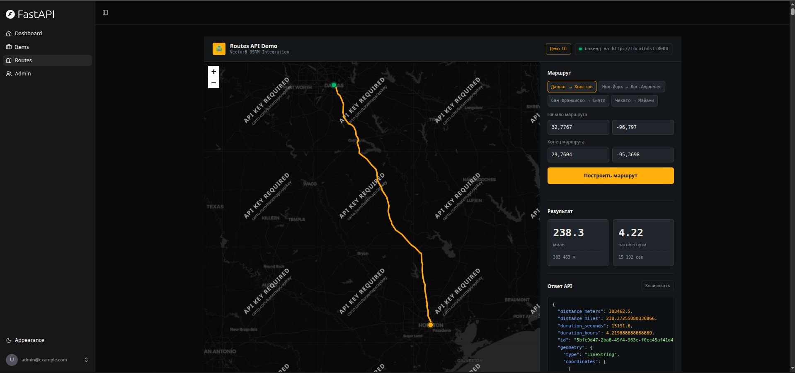
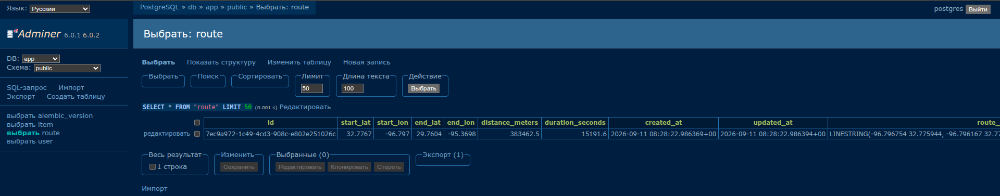

# Vector8 - Route Optimization Platform

[](../../actions/workflows/test-docker-compose.yml)
[](../../actions/workflows/test-backend.yml)

## 🎯 Overview

**Vector8** is a demonstration project showcasing route optimization and logistics planning capabilities. It provides a full-stack application for calculating, storing, and visualizing optimal routes between any two points using real-world routing data.

### 🚀 Key Capabilities

- **Interactive Route Calculation**: Calculate optimal driving routes with real-time visualization
- **Multiple Access Methods**: 
  - 🖥️ **Demo UI** - Beautiful interactive dashboard with map visualization
  - 📚 **Swagger API** - Full REST API documentation and testing interface
- **Route Storage**: Save routes to PostgreSQL database with complete geometry data
- **Route Visualization**: Interactive Leaflet map showing distance, duration, and route geometry
- **Statistics Display**: Real-time route metrics with smooth animations

### 📸 Routes Demo Interface



The demo UI provides an intuitive interface to:
- Select predefined route pairs or enter custom coordinates
- View interactive map with route visualization
- See distance and duration statistics
- Access complete route data in JSON format

---

## ⚡ Quick Start

### System Requirements
- Docker and Docker Compose installed
- ~5-10 minutes setup time
- Ports 8000, 5432, 8080 available

### Option 1: Using Makefile (Recommended)

If you have `make` installed:

```bash
# Complete fresh setup (cleans, builds, starts, runs migrations)
make fresh
```

### Option 2: Using Docker Compose Directly

If you don't have `make` installed, run this single command:

```bash
docker compose down -v && docker compose build && docker compose up -d && sleep 15 && docker compose exec -T backend bash -c "cd /app/backend && alembic upgrade head" && docker compose exec -T backend bash -c "cd /app/backend && python app/initial_data.py" && docker compose logs -f
```

This command:
1. Removes old containers and volumes
2. Rebuilds Docker images
3. Starts all services
4. Waits for database to be ready
5. Runs database migrations
6. Creates initial data
7. Shows live logs in the terminal

### Access the Application

Once started, open your browser:

- **🎨 Frontend Dashboard**: http://localhost:8000
- **🗺️ Routes Demo**: http://localhost:8000/routes
- **📚 API Documentation (Swagger)**: http://localhost:8000/docs
- **💾 Database UI (Adminer)**: http://localhost:8080
- **📧 Email Testing (Mailpit)**: http://localhost:8025

---

## 🔄 How to Request a Route

### Method 1: Using the Demo UI (Recommended for Testing)

1. Open http://localhost:8000/routes in your browser
2. Select a predefined route from the chips or enter custom coordinates
3. Click "Calculate Route" button
4. View the route on the interactive map with distance and time statistics

### Method 2: Using Swagger API

1. Open http://localhost:8000/docs
2. Find the POST `/api/v1/routes/` endpoint
3. Click "Try it out" and enter:
   ```json
   {
     "start_lat": 32.7767,
     "start_lon": -96.797,
     "end_lat": 29.7604,
     "end_lon": -95.3698
   }
   ```
4. Execute and view the response with complete route geometry

### Method 3: Using curl

```bash
curl -X POST http://localhost:8000/api/v1/routes/ \
  -H "Content-Type: application/json" \
  -d '{
    "start_lat": 32.7767,
    "start_lon": -96.797,
    "end_lat": 29.7604,
    "end_lon": -95.3698
  }'
```

---

## ✅ Verify Routes in Database

After requesting a route through the UI, API, or curl, you can verify that the data was saved to PostgreSQL:

### Step 1: Open Adminer Database UI

Open http://localhost:8080 in your browser

### Step 2: Log in to PostgreSQL

- **Server**: `db`
- **Username**: `postgres`
- **Password**: `password`
- **Database**: `app`

### Step 3: View the Routes Table

1. In the left sidebar, expand **public** schema
2. Click on the **route** table
3. You'll see all routes created through the API with:
   - **id**: Unique route identifier
   - **start_lat, start_lon**: Start coordinates
   - **end_lat, end_lon**: End coordinates
   - **distance_km**: Calculated distance
   - **duration_minutes**: Travel time
   - **geometry**: Complete route GeoJSON data (viewable in Leaflet map)
   - **created_at**: Timestamp of creation



This confirms that your route requests are being persisted in the database and are ready for retrieval through subsequent API calls.

---

## Technology Stack and Features

- ⚡ [**FastAPI**](https://fastapi.tiangolo.com) for the Python backend API.
  - 🧰 [SQLModel](https://sqlmodel.tiangolo.com) for the Python SQL database interactions (ORM).
  - 🔍 [Pydantic](https://docs.pydantic.dev), used by FastAPI, for the data validation and settings management.
  - 💾 [PostgreSQL](https://www.postgresql.org) as the SQL database.
  - 🗺️ PostGIS for spatial data and route geometry storage.
- 🚀 [React](https://react.dev) for the frontend.
  - 🧩 Built into the backend application and served by FastAPI on the same domain as the API.
  - 💃 Using TypeScript, hooks, [Vite](https://vitejs.dev), and other parts of a modern frontend stack.
  - 🎨 [Tailwind CSS](https://tailwindcss.com) and [shadcn/ui](https://ui.shadcn.com) for the frontend components.
  - 🗺️ [Leaflet](https://leafletjs.com) for interactive map visualization.
  - 🤖 An automatically generated frontend client.
  - 🧪 [Playwright](https://playwright.dev) for end-to-end testing.
  - 🦇 Dark mode support.
- ☁️ [FastAPI Cloud](https://fastapicloud.com) for deployment.
- 🐋 [Docker Compose](https://www.docker.com) for local services and self-hosted deployment.
  - 📞 [Traefik](https://traefik.io) as a reverse proxy with automatic HTTPS.
- 🔒 Secure password hashing by default.
- 🔑 JWT (JSON Web Token) authentication.
- 📫 Email-based password recovery.
- ✉️ [React Email](https://react.email) for email templates.
- 📬 [Mailpit](https://mailpit.axllent.org) for local email testing during development.
- ✅ Tests with [Pytest](https://pytest.org).
- 🏭 CI (continuous integration) and CD (continuous deployment) based on GitHub Actions.

## 📚 Screenshots & Features

### Interactive Route Visualization


### Dashboard Login


### Dashboard - Admin


### Dashboard - Items


### Dashboard - Dark Mode


### React Email Templates


### Mailpit - Local Email Testing


---

## 📖 Documentation

### Development & Setup
- **[DEVELOPMENT.md](./development.md)** - Detailed development setup and workflow
- **[MAKEFILE_USAGE.md](./MAKEFILE_USAGE.md)** - Complete Makefile commands reference
- **[REBRANDING.md](./REBRANDING.md)** - Details of Vector8 rebranding

### Project Specific Docs
- **[backend/README.md](./backend/README.md)** - Backend API documentation
- **[frontend/README.md](./frontend/README.md)** - Frontend development guide

### Deployment
- **[deployment.md](./deployment.md)** - FastAPI Cloud deployment guide
- **[deployment-docker-compose.md](./deployment-docker-compose.md)** - Docker Compose deployment guide

---

## 🎓 Learning Resources

This project demonstrates:
- ✅ Full-stack architecture with FastAPI + React
- ✅ Real-time data visualization with Leaflet maps
- ✅ Database optimization with PostGIS for spatial queries
- ✅ API-first development with automatic OpenAPI documentation
- ✅ Docker-based local development workflow
- ✅ Production-ready security practices (JWT, password hashing)
- ✅ Automated testing with Pytest and Playwright

---

## 📝 License

Vector8 is licensed under the terms of the MIT license.
