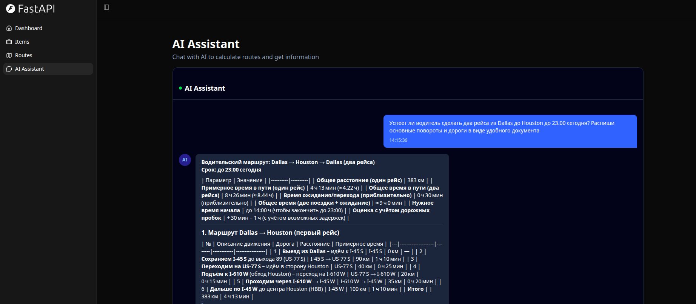

# Vector8 - Route Optimization Platform

[](../../actions/workflows/test-docker-compose.yml)
[](../../actions/workflows/test-backend.yml)

## 🎯 Overview

**Vector8** is a demonstration project showcasing route optimization and logistics planning capabilities. It provides a full-stack application for calculating, storing, and visualizing optimal routes between any two points using real-world routing data.

### 🚀 Key Capabilities

- **Interactive Route Calculation**: Calculate optimal driving routes with real-time visualization
- **Multiple Access Methods**: 
  - 🖥️ **Demo UI** - Beautiful interactive dashboard with map visualization
  - 📚 **Swagger API** - Full REST API documentation and testing interface
  - 🤖 **AI Assistant Chat** - Natural language interface with choice of multiple LLM providers (OpenAI, Groq)
- **Route Storage**: Save routes to PostgreSQL database with complete geometry data
- **Route Visualization**: Interactive Leaflet map showing distance, duration, and route geometry
- **Statistics Display**: Real-time route metrics with smooth animations
- **Intelligent AI**: Ask the AI assistant in plain English to calculate routes and get formatted responses

### 📸 Routes Demo Interface


The demo UI provides an intuitive interface to:
- Select predefined route pairs or enter custom coordinates
- View interactive map with route visualization
- See distance and duration statistics
- Access complete route data in JSON format

---

## 📥 Clone the Repository

First, clone the Vector8 repository from GitHub:

```bash
git clone https://github.com/Sana451/Vector8.git
cd Vector8
```

---

## ⚡ Quick Start

### System Requirements
- **Docker and Docker Compose** installed ✅ (required)
- ~5-10 minutes setup time
- Ports 8000, 5432, 8080 available
- `.env` file (automatically created from `.env.example` if missing)
- `bun` package manager (optional - Docker will be used as fallback for frontend build)
- **Groq API Key** *(optional, required only for AI Assistant chat)* - Get from [https://console.groq.com/keys](https://console.groq.com/keys)

### ⚙️ Optional: Setup Groq API Key for AI Assistant

To enable the AI Assistant Chat feature:

1. Get your Groq AI API key from: [https://console.groq.com/keys](https://console.groq.com/keys)
2. Add it to your `.env` file:
   ```env
   LLM_PROVIDER=groq
   GROQ_API_KEY=sk-proj-your-actual-key-here
   ```
3. Make sure you have:
   - ✅ Valid API key (not revoked or expired)
   - ✅ Payment method added to Groq account
   - ✅ Available credits or active subscription

> **Note:** The AI Assistant is optional. All other features work without it.
> 
> **Multi-Provider Support:** You can also use **Groq** instead of OpenAI! See [LLM_PROVIDER_GUIDE.md](./LLM_PROVIDER_GUIDE.md) for more info.

### Option 1: Using Makefile (Recommended)

If you have `make` installed, just run:

```bash
# Complete fresh setup (builds frontend, cleans, builds Docker images, starts, migrates)
make fresh
```

### Option 2: Using Docker Compose Directly

If you don't have `make` installed:

#### If you have `bun` installed locally:

```bash
cd frontend && bun install && bun run build && cd .. && [ ! -f .env ] && cp .env.example .env && echo "✓ Created .env from .env.example"; docker compose down -v && docker compose build && docker compose up -d && sleep 15 && docker compose exec -T backend bash -c "cd /app/backend && alembic upgrade head" && docker compose exec -T backend bash -c "cd /app/backend && python app/initial_data.py" && docker compose logs -f
```

#### If you DON'T have `bun` (Docker will build the frontend):

```bash
docker run --rm -v "$(pwd)/frontend:/app/frontend" -v "$(pwd)/backend:/app/backend" -w /app/frontend oven/bun:1 bash -c "bun install && bun run build" && [ ! -f .env ] && cp .env.example .env && echo "✓ Created .env from .env.example"; docker compose down -v && docker compose build && docker compose up -d && sleep 15 && docker compose exec -T backend bash -c "cd /app/backend && alembic upgrade head" && docker compose exec -T backend bash -c "cd /app/backend && python app/initial_data.py" && docker compose logs -f
```

Or, for better readability, the version with Docker frontend build:

```bash
# Build frontend using Docker
docker run --rm \
  -v "$(pwd)/frontend:/app/frontend" \
  -v "$(pwd)/backend:/app/backend" \
  -w /app/frontend \
  oven/bun:1 \
  bash -c "bun install && bun run build"

# Create .env if it doesn't exist
[ ! -f .env ] && cp .env.example .env && echo "✓ Created .env from .env.example"

# Then run the full Docker setup
docker compose down -v \
  && docker compose build \
  && docker compose up -d \
  && sleep 15 \
  && docker compose exec -T backend bash -c "cd /app/backend && alembic upgrade head" \
  && docker compose exec -T backend bash -c "cd /app/backend && python app/initial_data.py" \
  && docker compose logs -f
```

This command automatically:
1. **Builds the frontend** (uses local `bun` if available, or Docker as fallback)
2. **Creates .env file** if it doesn't exist (from .env.example)
3. **Removes old containers and volumes** 
4. **Rebuilds Docker images**
5. **Starts all services** (backend, database, mailpit, etc.)
6. **Waits for database to be ready**
7. **Runs database migrations**
8. **Creates initial data**
9. **Shows live logs** in the terminal

**Dependencies**: Only Docker and Docker Compose are required. `bun` is optional.

### Access the Application

Once started, open your browser:

- **🎨 Frontend Dashboard**: http://localhost:8000
- **🗺️ Routes Demo**: http://localhost:8000/routes
- **🤖 AI Assistant Chat**: http://localhost:8000/chat *(requires valid GROQ_API_KEY or OPENAI_API_KEY in .env)*
- **📚 API Documentation (Swagger)**: http://localhost:8000/docs
- **💾 Database UI (Adminer)**: http://localhost:8080
- **📧 Email Testing (Mailpit)**: http://localhost:8025

#### Frontend Dashboard (http://localhost:8000)

1. Open http://localhost:8000 in your browser
2. Login options:
   - **Option A: Create a new user**
     - Click "Sign up" button
     - Fill in your credentials
     - Submit and login with your new account
   
   - **Option B: Login as Superuser** (predefined admin account)
     - Open `.env` file in the project root
     - Find credentials: `FIRST_SUPERUSER` and `FIRST_SUPERUSER_PASSWORD`
     - Use these credentials to login on the dashboard

#### Database UI - Adminer (http://localhost:8080)

View and manage the PostgreSQL database:

**Quick Access (Easiest)**

Open this pre-configured link directly:
```
http://127.0.0.1:8080/?pgsql=db&username=postgres&db=app&ns=public&select=route
```

Then simply:
1. Enter password: Find `POSTGRES_PASSWORD` value in your `.env` file
2. Click "Login"
3. You'll be directly in the `route` table!

**Manual Configuration**

Or configure it manually:

1. Open http://localhost:8080 in your browser
2. Configure connection:
   - **Server**: `db`
   - **Username**: `postgres`
   - **Password**: Find `POSTGRES_PASSWORD` value in your `.env` file
   - **Database**: `app`
3. Click "Login"
4. In the left sidebar, expand **public** schema
5. Click on the **route** table to view all saved routes

#### Swagger API Documentation (http://localhost:8000/docs)

Test the API interactively:

1. Open http://localhost:8000/docs in your browser
2. Find the endpoint: **POST** `/api/v1/routes/`
3. Click on it to expand
4. Click the **"Try it out"** button
5. Enter request body:
   ```json
   {
     "start_lat": 32.7767,
     "start_lon": -96.797,
     "end_lat": 29.7604,
     "end_lon": -95.3698
   }
   ```
6. Click **"Execute"** button
7. View the response in the **"Responses"** section below
   - See the route geometry, distance, and duration

---

## 🔄 How to Request and View Routes

### Quick Start: Routes Demo UI

1. Open http://localhost:8000/routes in your browser
2. If not logged in, login with your account (or superuser credentials from `.env`)
3. Select a predefined route from the chips or enter custom coordinates
4. Click "Calculate Route" button
5. View the route on the interactive map with distance and time statistics

### Using the API (Swagger)

1. Go to http://localhost:8000/docs
2. Find the endpoint: **POST** `/api/v1/routes/`
3. Click "Try it out"
4. Enter example coordinates:
   ```json
   {
     "start_lat": 32.7767,
     "start_lon": -96.797,
     "end_lat": 29.7604,
     "end_lon": -95.3698
   }
   ```
5. Click "Execute" and check the "Responses" section for results

### Using curl Command

```bash
curl -X POST http://localhost:8000/api/v1/routes/ \
  -H "Content-Type: application/json" \
  -d '{
    "start_lat": 32.7767,
    "start_lon": -96.797,
    "end_lat": 29.7604,
    "end_lon": -95.3698
  }'
```

---

## ✅ Verify Routes in Database

After requesting routes, verify they were saved in PostgreSQL:

1. Open http://localhost:8080 (Adminer)
2. Login with:
   - **Server**: `db`
   - **Username**: `postgres`
   - **Password**: Get from `.env` file (`POSTGRES_PASSWORD`)
   - **Database**: `app`
3. Expand **public** schema in the left sidebar
4. Click on the **route** table
5. View all routes with:
   - **id**: Unique identifier
   - **start_lat, start_lon**: Start coordinates
   - **end_lat, end_lon**: End coordinates
   - **distance_km**: Calculated distance
   - **duration_minutes**: Travel time
   - **geometry**: Complete GeoJSON route data
   - **created_at**: Creation timestamp


---

## 🤖 AI Assistant Chat with MCP Integration

Vector8 includes an advanced **AI Assistant** powered by OpenAI with **Model Context Protocol (MCP)** integration. This allows the AI to intelligently process natural language requests and automatically call routing functions.

### ✨ Key Features of MCP Integration

- **Natural Language Processing**: Ask the AI assistant in plain English to calculate routes
- **Automatic Tool Calling**: AI automatically determines when and how to call route calculation tools
- **Context Awareness**: AI understands geography, distances, and travel times
- **Intelligent Responses**: Receives tool results and formats them into human-readable answers
- **Conversation History**: Maintains context across multiple messages

### 🎨 AI Assistant Chat Interface



The intuitive chat interface allows you to interact with the AI assistant in natural language, with beautiful message formatting supporting Markdown tables, code blocks, lists, and more.

### 🎯 Real-World Example

**You ask:** "What's the distance and time to drive from Dallas to Houston?"

**Behind the scenes:**
1. AI receives your message
2. AI recognizes a route calculation is needed
3. AI calls the `calculate_route` tool with Dallas/Houston coordinates
4. Tool returns: distance (380 km), time (4 hours)
5. AI formats the response in natural language

**AI responds:** "The drive from Dallas to Houston is approximately 380 km (236 miles) and takes about 4 hours of driving time."

### ⚙️ How MCP Works in Vector8

```
User Input (Natural Language)
         ↓
    OpenAI API
    (gpt-3.5-turbo)
         ↓
AI decides: "I need to call calculate_route"
         ↓
Tool Execution
(calculate_route function)
         ↓
API Call to /api/v1/routes/
         ↓
Results returned to AI
         ↓
AI formats response
         ↓
User sees answer
```

### 📋 Prerequisites for AI Chat

**⚠️ IMPORTANT:** To use the AI Assistant, you must have:

1. **Valid OpenAI API Key** in `.env` file
   ```env
   OPENAI_API_KEY=sk-proj-YOUR_ACTUAL_KEY_HERE
   ```
   
2. **Active OpenAI Account** with:
   - ✅ Valid API key (not revoked or expired)
   - ✅ Payment method added (Credit Card)
   - ✅ Available credits or active subscription
   
3. **Network Access** to OpenAI API (api.openai.com)

Get your API key from: https://platform.openai.com/account/api-keys

### 🚀 How to Use the AI Chat

#### Via Web Interface

1. **Login to Dashboard**
   - Open http://localhost:8000 in your browser
   - Login with your account

2. **Access AI Assistant**
   - Click **"AI Assistant"** in the sidebar menu
   - Or navigate to http://localhost:8000/chat

3. **Chat with the AI**
   - Type your message: *"Calculate route from New York to Boston"*
   - Press Enter or click Send
   - AI will automatically calculate the route and respond

#### Via API

```bash
curl -X POST http://localhost:8000/api/v1/chat/ \
  -H "Content-Type: application/json" \
  -d '{
    "message": "What is the distance between Los Angeles and San Francisco?",
    "history": []
  }'
```

**Response:**
```json
{
  "response": "The distance between Los Angeles and San Francisco is approximately 559 km (347 miles) and takes about 6 hours to drive."
}
```

### 💡 Example Queries

Try asking the AI:
- "Calculate a route from Dallas to Houston"
- "How long does it take to drive from NYC to Boston?"
- "What's the distance between these coordinates: 40.7128, -74.0060 and 34.0522, -118.2437?"
- "Show me the route details from San Francisco to Los Angeles"

### ⚙️ Configuration

The AI Chat uses multiple LLM provider options:

- **OpenAI (default)**: GPT-3.5-turbo for balanced performance
- **Groq**: Ultra-fast inference with Mixtral-8x7b

To change provider or model, edit `.env`:
```env
LLM_PROVIDER=openai  # or "groq"
OPENAI_API_KEY=sk-proj-your-key  # if using OpenAI
GROQ_API_KEY=gsk_your-key        # if using Groq
LLM_MODEL=gpt-3.5-turbo          # optional: override default model
```

Then restart Docker:
```bash
docker compose down
docker compose up -d
```

### 🐛 Troubleshooting AI Chat

**Error: "AI service is not properly configured"**
- Ensure `OPENAI_API_KEY` is set in `.env` file
- Rebuild Docker: `docker compose down && docker compose up -d`
- Wait 15-20 seconds for containers to start

**Error: "Incorrect API key provided" (401 Unauthorized)**
- The API key is not recognized by your LLM provider
- **For OpenAI**: Check https://platform.openai.com/account/api-keys
- **For Groq**: Check https://console.groq.com/keys
- Verify that both `LLM_PROVIDER` and corresponding API key are set in `.env`
- Create a new API key from provider and update `.env`
- Restart Docker containers

**Error: "Configuration error ... not configured"**
- Ensure the API key for your chosen provider is set in `.env`
- **If using OpenAI**: Make sure `OPENAI_API_KEY=...` is set
- **If using Groq**: Make sure `GROQ_API_KEY=...` is set  
- Restart Docker: `docker compose down && docker compose up -d`

**Error: "Unknown LLM provider"**
- Check that `LLM_PROVIDER` value is correct (must be lowercase: `openai` or `groq`)
- Ensure no typos in `.env`
- Restart Docker

**Error: "You exceeded your current quota"**
- Your LLM provider account ran out of credits or hit usage limits
- **For OpenAI**: Add payment method at https://platform.openai.com/account/billing/overview
- **For Groq**: Check quota at https://console.groq.com/usage

---

## Technology Stack and Features

- ⚡ [**FastAPI**](https://fastapi.tiangolo.com) for the Python backend API.
  - 🧰 [SQLModel](https://sqlmodel.tiangolo.com) for the Python SQL database interactions (ORM).
  - 🔍 [Pydantic](https://docs.pydantic.dev), used by FastAPI, for the data validation and settings management.
  - 💾 [PostgreSQL](https://www.postgresql.org) as the SQL database.
  - 🗺️ PostGIS for spatial data and route geometry storage.
- 🚀 [React](https://react.dev) for the frontend.
  - 🧩 Built into the backend application and served by FastAPI on the same domain as the API.
  - 💃 Using TypeScript, hooks, [Vite](https://vitejs.dev), and other parts of a modern frontend stack.
    - 🎨 [Tailwind CSS](https://tailwindcss.com) and [shadcn/ui](https://ui.shadcn.com) for the frontend components.
    - 🗺️ [Leaflet](https://leafletjs.com) for interactive map visualization.
    - 🤖 An automatically generated frontend client.
    - 🦇 Dark mode support.
- ☁️ [FastAPI Cloud](https://fastapicloud.com) for deployment.
- 🐋 [Docker Compose](https://www.docker.com) for local services and self-hosted deployment.
  - 📞 [Traefik](https://traefik.io) as a reverse proxy with automatic HTTPS.
- 🔒 Secure password hashing by default.
- 🔑 JWT (JSON Web Token) authentication.
- 📫 Email-based password recovery.
- ✉️ [React Email](https://react.email) for email templates.
- 📬 [Mailpit](https://mailpit.axllent.org) for local email testing during development.
- ✅ Tests with [Pytest](https://pytest.org).
- 🏭 CI (continuous integration) and CD (continuous deployment) based on GitHub Actions.
- 🤖 **AI Assistant with MCP Integration**:
  - 🧠 Multi-provider LLM support (OpenAI, Groq, extensible)
  - 💬 [OpenAI](https://openai.com) API for GPT-3.5-turbo and GPT-4
  - ⚡ [Groq](https://groq.com) API for ultra-fast inference
  - 🔗 Model Context Protocol (MCP) for intelligent tool calling
  - 🛠️ Automatic route calculation through AI-driven tool execution
  - 🔄 Easy provider switching via environment configuration

## 📚 Screenshots & Features

### Interactive Route Visualization


### Dashboard Login


### Dashboard - Admin


### Dashboard - Items


### Dashboard - Dark Mode


### React Email Templates


### Mailpit - Local Email Testing


---

## 📖 Documentation

### Understanding the Project
- **[ARCHITECTURE.md](./ARCHITECTURE.md)** - System architecture and component design
- **[DEVELOPMENT.md](./development.md)** - Detailed development setup and workflow

### How-to Guides
- **[MAKEFILE_USAGE.md](./MAKEFILE_USAGE.md)** - Complete Makefile commands reference
- **[backend/README.md](./backend/README.md)** - Backend API documentation
- **[frontend/README.md](./frontend/README.md)** - Frontend development guide

### Deployment
- **[deployment.md](./deployment.md)** - FastAPI Cloud deployment guide
- **[deployment-docker-compose.md](./deployment-docker-compose.md)** - Docker Compose deployment guide

---

## 🎓 Learning Resources

This project demonstrates:
- ✅ Full-stack architecture with FastAPI + React
- ✅ Real-time data visualization with Leaflet maps
- ✅ Database optimization with PostGIS for spatial queries
- ✅ API-first development with automatic OpenAPI documentation
- ✅ Docker-based local development workflow
- ✅ Production-ready security practices (JWT, password hashing)
- ✅ Automated testing with Pytest

---

## 📝 License

Vector8 is licensed under the terms of the MIT license.
